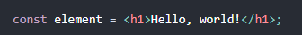
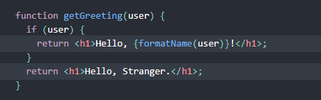

# Tuần 9: Học về ReactJS- Các khái niệm cơ bản của ReactJS
## 1- Khái niệm ReactJS:
ReactJS là một thư viện JavaScript dùng để xây dựng giao diện người dùng (UI).
## 2 JSX:
Có một loại cú pháp, khá giống kiểu lai giữa HTML và JavaScript đơn thuần, nó trông như dưới đây:

- Nó là cú pháp kiểu JSX, một loại cú pháp mở rộng cho Javascript; trông sẽ khá giống một Template Language.
Tuy nhiên, nó đi kèm với toàn bộ tính năng của Javascript. JSX được khuyến khích sử dụng cùng React để mô tả UI.
Nó cho phép React hiển thị các thông báo và lỗi một các dễ dàng hơn.
- Thay vì tách bạch giữa các thành phần giao diện và xử lý logic, React tách bạch các đơn vị rời rạc gọi là các Components, trong đó chứa cả hai cái trên. Điều này sẽ được trình bày ở phần dưới.
### 2.1 Nhúng biểu thức JS trong JSX:
- Ta có thể nhúng một biểu thức JS bất kì vào trong một cú pháp JSX bằng cặp dấu <>, miễn là biểu thức đó hợp lệ
- Không chỉ biểu thức, một hàm, một biến số hay hằng số đều có thể thực hiện tương tự.
### 2.2 JSX cũng là một biểu thức:
- Khi chạy, JSX trở thành các đối tượng của JS sau khi được gọi. Và chúng ta hoàn toàn có thể sử dụng JSX bên trong câu lệnh JS.
- Hàm dưới đây của JS, trả về các đối tượng JSX trong hai trường hợp khác nhau của người dùng:

- Chúng ta cũng có thể sử dụng một khai báo kiểu JSX để khai báo một chuỗi trở thành một nơi lưu trữ thông tin thuộc tính của một thẻ.
- reactDOM sử dụng quy tắc đặt tên kiểu camelCase cho JSX, đương nhiên là chúng ta nên theo quy tắc này.
- Bởi nó khá giống XML với cả HTML, không ngạc nhiên khi mà ta có thể đặt một thẻ con, thành phần con bên trong một thẻ khác, miễn là nó nằm trước tag đóng "/>".
### 2.3 Chống tấn công kiểu Injection:
- reactDOM mặc định đưa mọi thứ thành chuỗi trước khi render chúng, và loại bỏ các kí tự đặc biệt bên trong các giá trị được nhúng vào trước khi render JSX.
- Việc này giúp ngăn chặn tấn công kiểu cross-site scripting (chỗ này em không hiểu về cross-site scripting)!
### 2.4 Nó là đối tượng: 
- JSX sẽ được biên dịch, về cơ bản React.createElement() sẽ tạo ra một đối tượng, nó chứa các thuộc tính về tên thẻ, text bên trong thẻ đó.
- Những đối tượng này được gọi là react elements, nó sẽ là mô tả của những gì được render ra màn hình, React dùng chúng để xây dựng và cập nhật DOM.
