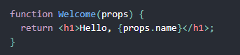
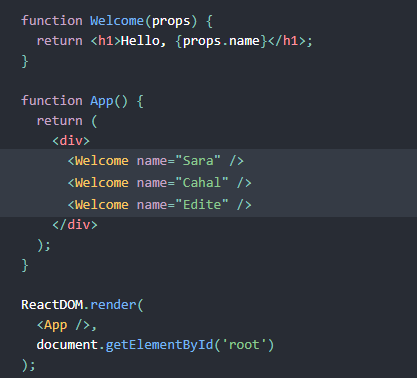
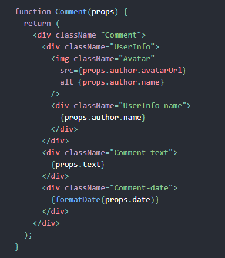

# Tuần 9: Học về ReactJS- Các khái niệm cơ bản của ReactJS
## 1- Khái niệm ReactJS:
ReactJS là một thư viện JavaScript dùng để xây dựng giao diện người dùng (UI).
## 2- JSX:
Có một loại cú pháp, khá giống kiểu lai giữa HTML và JavaScript đơn thuần, nó trông như dưới đây:

- Nó là cú pháp kiểu JSX, một loại cú pháp mở rộng cho Javascript; trông sẽ khá giống một Template Language.
Tuy nhiên, nó đi kèm với toàn bộ tính năng của Javascript. JSX được khuyến khích sử dụng cùng React để mô tả UI.
Nó cho phép React hiển thị các thông báo và lỗi một các dễ dàng hơn.
- Thay vì tách bạch giữa các thành phần giao diện và xử lý logic, React tách bạch các đơn vị rời rạc gọi là các Components, trong đó chứa cả hai cái trên. Điều này sẽ được trình bày ở phần dưới.
### 2.1 Nhúng biểu thức JS trong JSX:
- Ta có thể nhúng một biểu thức JS bất kì vào trong một cú pháp JSX bằng cặp dấu <>, miễn là biểu thức đó hợp lệ
- Không chỉ biểu thức, một hàm, một biến số hay hằng số đều có thể thực hiện tương tự.
### 2.2 JSX cũng là một biểu thức:
- Khi chạy, JSX trở thành các đối tượng của JS sau khi được gọi. Và chúng ta hoàn toàn có thể sử dụng JSX bên trong câu lệnh JS.
- Hàm dưới đây của JS, trả về các đối tượng JSX trong hai trường hợp khác nhau của người dùng:

- Chúng ta cũng có thể sử dụng một khai báo kiểu JSX để khai báo một chuỗi trở thành một nơi lưu trữ thông tin thuộc tính của một thẻ.
- reactDOM sử dụng quy tắc đặt tên kiểu camelCase cho JSX, đương nhiên là chúng ta nên theo quy tắc này.
- Bởi nó khá giống XML với cả HTML, không ngạc nhiên khi mà ta có thể đặt một thẻ con, thành phần con bên trong một thẻ khác, miễn là nó nằm trước tag đóng "/>".
### 2.3 Chống tấn công kiểu Injection:
- reactDOM mặc định đưa mọi thứ thành chuỗi trước khi render chúng, và loại bỏ các kí tự đặc biệt bên trong các giá trị được nhúng vào trước khi render JSX.
- Việc này giúp ngăn chặn tấn công kiểu cross-site scripting (chỗ này em không hiểu về cross-site scripting)!
### 2.4 Nó là đối tượng: 
- JSX sẽ được biên dịch, về cơ bản React.createElement() sẽ tạo ra một đối tượng, nó chứa các thuộc tính về tên thẻ, text bên trong thẻ đó.
- Những đối tượng này được gọi là react elements, nó sẽ là mô tả của những gì được render ra màn hình, React dùng chúng để xây dựng và cập nhật DOM.
## 3- Rendering element vào DOM:
- Trong tệp HTML, có các thẻ, các thẻ này trong DOM (Data object model) được coi là các node, trong react cũng tương tự.
- Thường trong react, các ứng dụng được xây dựng với duy nhất một root node.
- Để render element vào trong một nốt gốc của DOM, nó cần được truyền vào ReactDOM.render().
- Các react element là bất biến, khi đã tạo ra, nó không thể thay đổi các con và thuộc tính của mình. Tức là tại một thời điểm nhất định, nó đã được định sẵn "khung hình" cho UI tại thời điểm đó. Cách để thay đổi UI là thêm mới một element và truyền nó vào ReactDOM.render().
- Khi thay đổi, ReactDOM sẽ so sánh và chỉ thay đổi những thứ cần thiết để đạt được trạng thái mong muốn.
## 4- Components & Props:
- Các compenents cho phép ta chia UI thành các thành phần nhỏ độc lập, tách biệt nhau và khả tái dụng.
### 4.1 Về Components:
- Để định nghĩa một component, cách đơn giản là viết cho nó một hàm JS:

- Đây là một function JS đúng nghĩa đen luôn, và nó định nghĩa một component của react nhận đầu vào là một tham số đối tượng "props".
- Rendering components:
Khi ta định nghĩa một element của React trong DOM tag, element này cũng có thể biểu diễn các component do ta tự định nghĩa, khi React thấy element biểu diễn một component, nó sẽ truyền các thuộc tính JSX và các phần tử con vào component này như là một đối tượng, ta gọi đối tượng này là "props".
### 4.2 Tạo một component:
- Components có thể tham chiếu đến các components khác tại đầu ra của chúng, tức là ta có thể tạo ra một component mà khi render nó ta sẽ có thể render ra một hoặc nhiều các component khác:

Trong ví dụ trên đây, ta có thể tạo ra component tên là "App" mà nó có thể render ra một loạt cái khác là các "Welcome...".
- Ta cũng có thể tách Component lớn thành các component khác nhỏ hơn.
- Ví dụ như dưới đây, ta có một component chứa các thẻ "
", trong đó lại chứa các thẻ  và các thẻ 
 khác mà nó chứa các thông tin tên, ngày, nội dung của một comment trên mạng xã hội:

- Ta có thể thấy nó nhận một đối tượng truyền vào là "props", nó chứa đối tượng "author", đối tượng này lại chứa các thuộc tính con...
Một cấu trúc lồng nhau như thế này khá là phức tạp và rất khó thay đổi. Vậy ta có thể chia nhỏ nó ra thành mấy cái nhỏ hơn, mỗi cái chịu trách nhiệm cho một thuộc tính của cái đối tượng trên, ta sẽ có component chứa avatar và userName nằm trong một cái component gọi là userInfor, ngoài ra còn có một cái chứa nội dung text của comment, tất cả chúng nằm trong Component comment.
### 4.3 Về Props:

